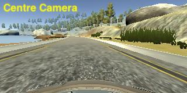
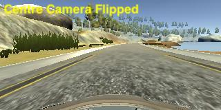
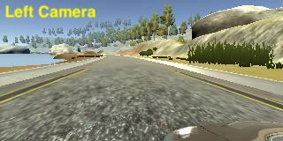
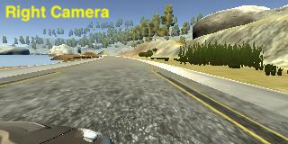
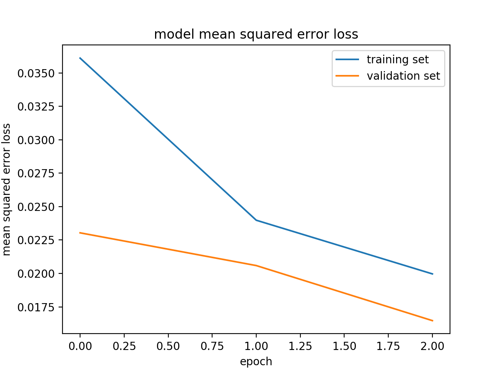

# Behavioural Cloning

The goals / steps of this project are the following:
* Use the simulator to collect data of good driving behaviour
* Build, a convolution neural network in Keras that predicts steering angles from images
* Train and validate the model with a training and validation set
* Test that the model successfully drives around track one without leaving the road
* Summarize the results with a written report

## Model Architecture

```
Layer (type)                     Output Shape          Param #     Connected to
====================================================================================================
cropping2d_1 (Cropping2D)        (None, 90, 320, 3)    0           cropping2d_input_1[0][0]
____________________________________________________________________________________________________
lambda_1 (Lambda)                (None, 90, 320, 3)    0           cropping2d_1[0][0]
____________________________________________________________________________________________________
convolution2d_1 (Convolution2D)  (None, 86, 316, 24)   1824        lambda_1[0][0]
____________________________________________________________________________________________________
maxpooling2d_1 (MaxPooling2D)    (None, 43, 158, 24)   0           convolution2d_1[0][0]
____________________________________________________________________________________________________
convolution2d_2 (Convolution2D)  (None, 39, 154, 36)   21636       maxpooling2d_1[0][0]
____________________________________________________________________________________________________
maxpooling2d_2 (MaxPooling2D)    (None, 19, 77, 36)    0           convolution2d_2[0][0]
____________________________________________________________________________________________________
convolution2d_3 (Convolution2D)  (None, 15, 73, 48)    43248       maxpooling2d_2[0][0]
____________________________________________________________________________________________________
maxpooling2d_3 (MaxPooling2D)    (None, 7, 36, 48)     0           convolution2d_3[0][0]
____________________________________________________________________________________________________
convolution2d_4 (Convolution2D)  (None, 5, 34, 64)     27712       maxpooling2d_3[0][0]
____________________________________________________________________________________________________
convolution2d_5 (Convolution2D)  (None, 3, 32, 64)     36928       convolution2d_4[0][0]
____________________________________________________________________________________________________
flatten_1 (Flatten)              (None, 6144)          0           convolution2d_5[0][0]
____________________________________________________________________________________________________
dense_1 (Dense)                  (None, 100)           614500      flatten_1[0][0]
____________________________________________________________________________________________________
dropout_1 (Dropout)              (None, 100)           0           dense_1[0][0]
____________________________________________________________________________________________________
dense_2 (Dense)                  (None, 50)            5050        dropout_1[0][0]
____________________________________________________________________________________________________
dropout_2 (Dropout)              (None, 50)            0           dense_2[0][0]
____________________________________________________________________________________________________
dense_3 (Dense)                  (None, 10)            510         dropout_2[0][0]
____________________________________________________________________________________________________
dense_4 (Dense)                  (None, 1)             11          dense_3[0][0]
====================================================================================================
Trainable params: 751,419
```

This model is based on the NVIDIA Architecture recommended for self driving tasks ([ref](https://devblogs.nvidia.com/parallelforall/deep-learning-self-driving-cars/)). The model consists of 5 convolution layers with RELU activation on each layer, a few max-pooling layers to reduce dimensionality and 4 fully connected layers at the end to get the right prediction size.

To reduce overfitting, 2 dropout layers are added for regularisation. The model was also trained using a mixture of data from track 1 and track 2 in order to develop a more generalised model.

The model used an adam optimizer, so the learning rate was not tuned manually.

## Data

### Flip Image

Each image is added to the data set once normally and then flipped left-right to be added again. This will help reduce the left turn bias of the model as well as creating more data for training without actually acquiring them. If we are acquiring data from a real car, data acquisition can be expensive. Generating more valid data from existing data can help reduce cost and improve training. Here is an example of the original image and the flipped image:



### using side camera

The data set contains images captured from the vehicle's side cameras. The side camera images are displaced from the centre image hence the steering angle need to be corrected. A small correction is applied to the steering angle in order to steer the car towards the middle of the road. If the correction value is too large, the car will over correct and sway uncontrollably in the road. If the correction value is too small the car does not sufficiently stay in the centre of the road and runs off road. Here is an example of the centre and side camera images:




### Cropping

Each image is cropped to remove the sky and car hood bits which are irrelevant to determining the steering angle. Thus the model can focus on learning salient features on the road. This processing stage is built directly into the keras model as a cropping layer.

### Data Acquisition

Data is recorded for one lap of driving at 30 mph clockwise. Because the lap is a circuit, the car have a tendency to turn left. Hence the same lap is recorded again driven counter-clockwise such that the sum of the two laps will not show any left turn bias.

At this point the trained model can drive around the first few turns. Then it hit a corner with a dirt edge and drove into the dirt. To correct this behaviour, a new batch of data is collected which only contain segments where car recovers from side of road to the centre of road, emphasising the dirt road-sides.

Then the newly trained model can drive the car around the circuit but clips a few corners. To correct this behaviour, more data is collected which only contains segments where the car goes around corners.

Now the model can drive the car around corners smoothly at 10 mph. The target speed of the vehicle is then changed to 30 mph which is the maximum speed of the simulation. During straight bits of the track the car swayed side to side on the road. The largest factor in the training data that causes the car to correct towards the middle of the road should be the side camera images. It is theorised that the correction value applied to the steering angle of the side image cameras is too large. Hence the correction value is reduced and model trained again. This resulted in a much improved output.

In order to develop a more generalised model, data from track 2 is also fed into the training process.

## Training

In the end, with the acquired images and data augmentation, a total of 31305 samples were used for training. Generators are used to reduce the memory consumption of the training process. In a test case of a training data set of 3000 pictures, the memory consumption reduced from 5GB to 0.5GB, a 10x reduction. 20% of the input data set is reserved as a validation set. The training script is written such that different data sets can be supplied on the command line and an already trained model can be fine tuned using new data.

```
> ./model.py -h
usage: model.py [-h] -o OUTPUT -i [INPUT_FOLDER [INPUT_FOLDER ...]]
                [-b BASE_MODEL] [-n NB_EPOCH] [-c CORRECTION] [-s]

Train a model to drive a simulated vehicle around a simulated track

optional arguments:
  -h, --help            show this help message and exit
  -o OUTPUT, --output OUTPUT
                        output model file name
  -i [INPUT_FOLDER [INPUT_FOLDER ...]], --input-folder [INPUT_FOLDER [INPUT_FOLDER ...]]
                        input folders, You can also specify multiple folders:
                        -i <path1> <path2>'
  -b BASE_MODEL, --base-model BASE_MODEL
                        load a trained model to start with
  -n NB_EPOCH, --nb-epoch NB_EPOCH
                        number of epoch
  -c CORRECTION, --correction CORRECTION
                        correction to the middle
  -s, --save-history    File where to save the training history
```

For example to fine tune a model using new data, you can invoke:
```
> ./model.py -i data/track\ 1/drive\ 4\ bend/ -o model.h5 -b model.h5 -c 0.1 -s
```
Because of the -s switch, the training history is also saved as a pickle file.

The model is trained for 3 epochs and the losses for the training set and validation set is shown below:


With 3 epochs, the model can achieve very low MSE within a reasonable time-frame. Overfitting is prevented by using data from different driving tracks and dropout layers.
